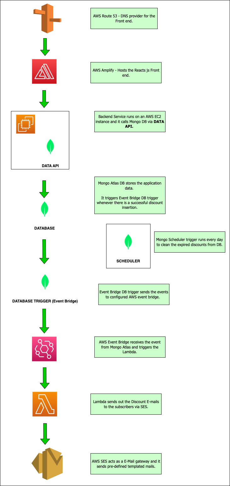

# Discount Portal
Discount Portal is a Web application that sends product discount newsletters to subscribers. Click [here](https://portal.forexample.link/) to access the portal.

This is application is developed for Mongo Atlas Hackathon 2021/2022.

(The portal requires Google Auth to login. Currently it's only allowed to my user.)

Click [here](https://dev.to/harik8/discount-portal-send-discount-newsletters-1e02) to view the dev.to page about this application.

 

  

 

# Folder Structure

- assets    - Screenshots and images.
- backend   - Backend service (server.py) which add records to Mongo Atlas Database via Data API.
- functions - AWS Lambda function to send mails and Realm scheduler function to clean DB.
- templates - AWS SES Email template.

 

# Technologies Used

- React JS             - Front end
- Python               - Back end
- Mongo Atlas Services

 

# Service Flow Chart

